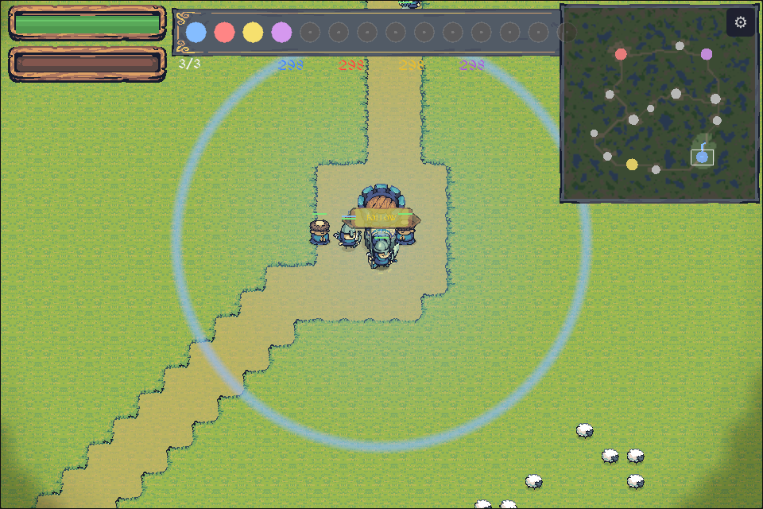
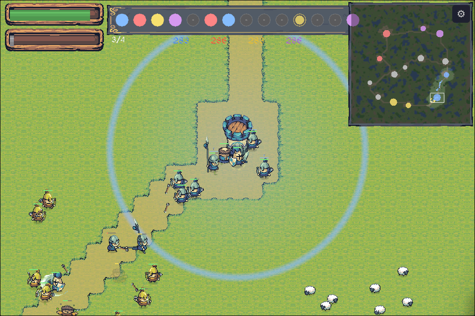
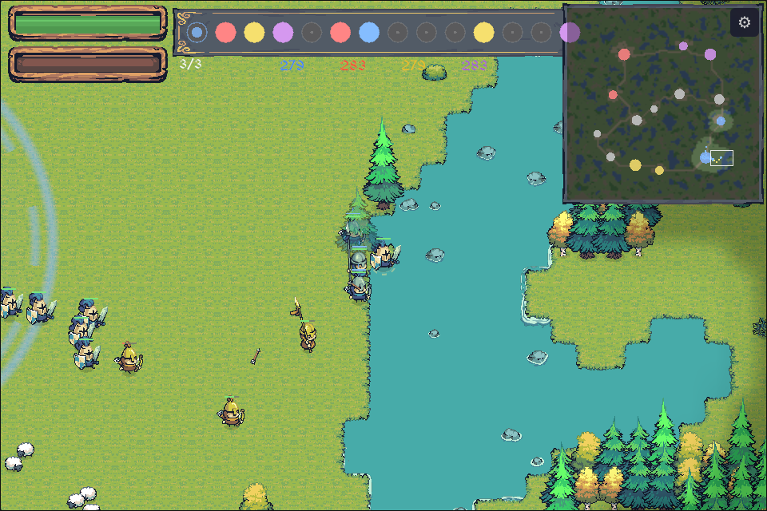
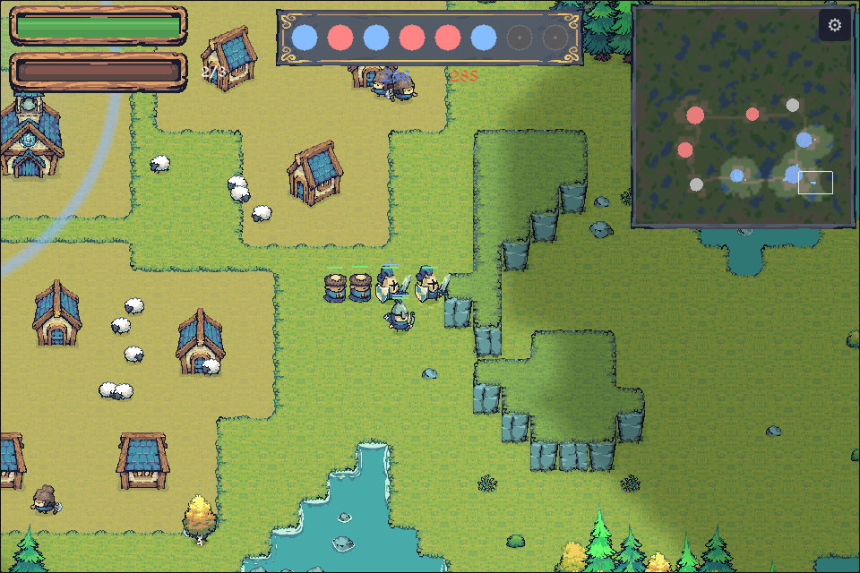

# The Battlefield -- Game Design Document

> This document describes the game as currently implemented. Ideas that were
> part of earlier designs but are not (or no longer) in the game are collected
> in [Future Directions](#future-directions) at the end.

## Game Overview

**Title:** The Battlefield
**Genre:** Real-time action / battle sim with a roguelike run structure
**Platform:** Web (PWA, mobile-first, playable offline), desktop Linux, Raspberry Pi
**Perspective:** Top-down, square grid
**Art:** Tiny Swords asset pack (Pixel Frog) -- chibi pixel art, 64x64 tile grid

**Elevator pitch:** You are one soldier in a massive medieval war between up to four armies fighting over a network of cities, towns and villages. Survive. Fight. Earn authority. Turn the tide. Die. Try again.

**Core fantasy:** You're not the general. You're not the hero -- at least not at first. You're a soldier in the ranks, fighting for your life in a real-time battle much larger than yourself. The armies clash around you whether you act brilliantly or not -- but by fighting well you build a reputation, and soldiers who have seen your deeds will follow your orders.

## Screenshots

| | |
|---|---|
|  |  |
|  |  |

## Core Pillars

### 1. One Soldier, One Life

Every run is one soldier's experience of one battle. Permadeath means every decision carries weight. When you fall, the battle continues without you.

### 2. The Battle Is Bigger Than You

Every army fights autonomously: each faction's AI planner picks objectives, reinforcement waves march from its cities, and settlements change hands with or without you. Your actions influence your local area -- and through the authority system, increasingly more than that.

### 3. Authority Is Earned

You start unknown. Kills, assists, and zone captures witnessed by nearby allies raise your authority; allied deaths near you lower it. The higher your authority, the more soldiers will accept your orders, and the farther your command reaches.

## Game Loop

### Run Structure

1. **Battle generation** -- A seeded, deterministic settlement network is generated: terrain, a capital city per faction, a countryside of towns, villages and hamlets, and the roads that join them. Generation runs in budgeted steps behind a loading bar, so even the largest maps never stall a frame.
2. **Deployment** -- You spawn as a Blue Warrior at your capital, alongside your army's starting force. One to three AI armies (Red, Yellow, Purple) spawn at their own capitals.
3. **Battle** -- Real-time free-for-all. Fight, capture settlements, issue orders to allies who respect you.
4. **Resolution** -- The run ends when you die (permadeath) or one faction wins (see [Victory](#victory-and-attrition)).
5. **New run** -- Retry from the death/victory/defeat screen; a new seed produces a new battlefield.

### Game Modes

- **Free Play** (default) -- the full game at its own pace: the war ends only by conquest or your death. Every run begins as a **neutral villager** (5 HP) at the countryside settlement farthest from the capitals. Soldiers ignore the bystander, but stray cone swings and arrows still hurt -- crossing a battle line is a choice. Walking into any army-owned production building **enlists you on the spot**: you become the unit kind it trains, in its owner's color, and the full player kit (attack, orders, authority, retinue) unlocks. Neutral villages' buildings serve no lord. Unscored.
- **Arcade** -- the scored mode, classic Blue-soldier start. An **escalation ladder** starts at 1v1; each victory raises the enemy count up to 1v3, any defeat resets it to 1v1. The ladder level is persisted with the high scores and shown on the main menu. Score counts **deeds only** -- kills, settlement captures, peak authority, victory bonus, all multiplied by the enemy count; no points for hiding. Top-10 scoreboard with initials entry.
- **Skirmish** -- a configurable single battle: map seed, enemy count (1-3), map size, **starting side** (any army color, or NEUTRAL for the villager origin), production pace, army cap, and starting authority.

### Screens

`MainMenu → SkirmishSetup? → Loading → Playing → PlayerDeath | GameWon | GameLost → ScoreEntry? → ScoreBoard? → (retry / new game)`

## Map and Battlefield

### Grid

The world is a square tile grid at 64px per tile: a playable area surrounded by a 16-tile impassable border. The playable size is configurable -- **AUTO** scales with the enemy count (160/192/224), and the skirmish MAP SIZE row offers **LARGE** (384²), **HUGE** (512²) and **COLOSSAL** (1024²), each validated by a performance gate. Positions are continuous (floating point); the grid governs terrain, passability, pathfinding, and auto-tiling. Units render in 192x192 frames (the mounted Lancer in 320x320), Y-sorted for correct overlap.

### Terrain

Seeded procedural generation (simplex-noise heightmap, cellular-automata water and forests) produces:

- **Grass** -- open ground, auto-tiled with a 4-bit cardinal bitmask.
- **Elevated ground** -- raised terrain with cliff faces and shadows.
- **Water** -- impassable, animated foam edges.
- **Forest** -- tree decorations; pawns chop trees for ambience.
- **Rocks** -- impassable decorations.
- **Roads** -- 2-tile dirt roads routed by A* between settlements. Roads are **highways**: all units move ~25% faster on them, so armies naturally form marching columns.

The same seed always generates the same battlefield; different seeds differ. The whole pipeline is a resumable state machine (`MapGen`): terrain phases run in row bands and road routing in bounded A* slices, drained synchronously by tests and across frames by the loading screen -- identical output either way.

### The Settlement Network

The battlefield is a countryside of settlements joined by roads. Capitals are placed by farthest-point sampling (fairness first, then terrain quality); towns, villages and hamlets fill the land by best-candidate sampling -- 1v1 maps mirror the countryside about the capital midpoint so both sides get identical terrain value. Settlement count scales with map area (up to 28). Roads form a minimum spanning tree plus loop edges (every settlement reaches degree 2 where possible), and the road edges **are** the adjacency graph the AI plans over.

| Tier | Capture radius | Garrison cap | Notes |
|------|:---:|:---:|-------|
| Hamlet | 5 | 2 | A few houses and one worked resource |
| Village | 6 | 4 | The standard countryside settlement |
| Town | 7 | 6 | Larger ring, more houses |
| City | 8 | 8 | Faction capitals; band-layout stronghold |

**Everything is capturable, including capitals.** A faction that loses its capital fights on from its largest remaining settlement -- reinforcements spawn and rally at the biggest settlement it still controls.

### Capitals

Each faction starts in control of one **City**: a seeded band layout rotated to face the nearest rival -- castle and 3-5 defense towers on the front arc, one production building per wave unit kind on the flanks, 8-12 houses and the sheep pasture in the rear:

| Building | Role |
|----------|------|
| Castle | Defensive anchor -- fires arrows like 4 archers |
| Defense Tower | Defensive -- fires like 2 archers |
| Barracks | Produces Warriors and Lancers |
| Archery Range | Produces Archers |
| Monastery | Produces Monks |
| Houses | Decorative; pawns and sheep live around them |

### Settlements are Villages

Every settlement below City tier is a working **village** with one worked resource, themed per seed (all three themes appear on every map):

| Theme | Resource | Peons | Production building |
|-------|----------|-------|---------------------|
| Mining camp | Gold stones (impassable) | Pickaxe, carry gold | Barracks (warriors) |
| Lumber camp | Tree grove | Axe, carry wood | Archery (archers) |
| Pasture | Sheep pen | Knife, carry meat | Monastery (monks) |

Each village has houses (one peon each, count by tier), its production buildings, and the defense tower at its heart. Buildings ring the **outside** of the capture circle, keeping the fighting ground open. Buildings and peons are **Black (neutral) until captured**, then recolor to the owner's faction.

**The settlement economy:** each peon delivery banks 1 **stock** (cap 5) at its settlement -- capitals included, their worked resource rings deliver like any village. Stock is the only war currency: every **production building** in an owned settlement spends 1 stock to train 1 normal soldier of its kind on a fixed interval, throttled by the army cap. Reinforcement flow scales with territory and arrives **distributed across the empire** -- no waves, no rally phase; recruits march to the planner's objectives from wherever they were born. Neutral settlements run the same rule in Black: their militia stays home (defend-zone stance, tier-capped), engages intruders within a short leash, and pledges to a captor when the village falls. Peons **flee combat**, so scattering a village's workers stalls its training without capturing it. Militia contests with swords, not the circle: it does not block capture progress. Militia of quiet settlements **sleeps** (skips its AI entirely) until a hostile enters the settlement's influence radius. Soldiers of your color stationed at settlements are ordinary recruits: walk by with authority and they rejoin your retinue; stationed monks patrol their zone healing any wounded friendly, making pasture villages the road network's healing stops.

**Majority capture:** capture is multi-faction -- a zone tracks every army inside it, and progress moves at the rate of the *strength advantage* of the strongest faction over all others combined (√advantage). Equal forces freeze the zone; a minority garrison slows an assault but cannot hold forever -- overwhelming force completes the capture even with defenders still alive. Attacking a defended point is a readable numbers race, not a binary stall.

Zone states: **Neutral → Contested → Capturing(faction) → Controlled(faction)**.

### Victory: Conquest Only

- **Elimination:** a faction is eliminated when it owns **no settlements** and fields **no living units**. A landless remnant army fights on and can recapture -- but without a supply line it **starves** (units wither after a short grace), so remnants cannot stall a decided war.
- **Last banner standing wins.** No domination timer, no sudden death, no clocks: the settlement economy makes stalemates self-resolving -- every captured village compounds into more soldiers.
- **Player death** ends the run immediately; if the player's faction is eliminated while rivals still fight, the run ends crediting the current settlement leader.

**War score:** the HUD shows each faction's tier-weighted holdings (City 4, Town 3, Village 2, Hamlet 1). The AI planner reads the same number to gang up on whoever is winning.

## Units

Up to four armies fight -- **Blue** (always the player) against **Red**, **Yellow** and **Purple** AI factions -- plus the neutral **Black** villager militia. It is a true free-for-all: every faction is hostile to every other, and the AIs fight each other as readily as they fight you. All armies field the same four unit types:

| Unit | Role | HP | ATK | DEF | Range (tiles) |
|------|------|:---:|:---:|:---:|:---:|
| Warrior | Frontline melee, balanced attack and defense | 10 | 3 | 3 | 1 |
| Archer | Ranged attacker, fragile up close, kites melee | 6 | 2 | 1 | 7 |
| Lancer | Fast cavalry, hits hard, backs off after striking | 10 | 4 | 1 | 2 |
| Monk | Healer -- avoids combat, flees enemies, heals nearby allies | 5 | 1 | 1 | 2 |

Stats live in `GameConfig` and can be rebalanced at runtime. Damage is `max(1, ATK - DEF)`. Dead units explode into particles and fade out; the player's corpse stays on the field.

## The Player

You play a single soldier in real time -- a Blue Warrior in Arcade, your chosen side in Skirmish, or whoever you enlist as in Free Play:

- **Movement** -- continuous 360° movement via virtual joystick (touch), WASD/arrows (keyboard), or gamepad stick.
- **Attack** -- an explicit attack action (button / Space / gamepad) that hits all enemies in a 180° cone in your facing direction, with knockback. No auto-attack. **You fight exactly like other soldiers**: AI melee units use the same cone swing, knockback, and reach (1.5 tiles), at the same rate.
- **Fog of war** -- you see a personal field-of-view radius; the rest of the map is fogged (FOV recomputed every third frame for performance).

### Authority

Authority is a 0-100 reputation score, displayed as a rank:

| Authority | Rank |
|:---:|------|
| 0+ | Unknown |
| 20+ | Known |
| 40+ | Veteran |
| 60+ | Hero |
| 80+ | Legend |

It changes in response to events **witnessed within your reputation FOV** -- kills and assists you land, zones captured while you're present (positive); allied deaths nearby, zones lost (negative). Authority determines three things, each scaling linearly with the score:

1. **Recruitment chance** -- the probability an allied unit joins your retinue.
2. **Command radius** -- how far around you recruitment reaches.
3. **Max followers** -- how many soldiers your retinue can hold.

### The Retinue (auto-follow)

Soldiers join you on their own. Every second, allied units inside your command radius with no current assignment roll a deterministic acceptance check (same unit + same authority level = same answer, so there is nothing to reroll); accepters become **sticky followers** up to your follower cap. Failures are silent. Followers stay yours until they die, you die, you Dismiss them, or they lose contact (left more than 15 tiles behind for a few seconds).

The pull is always on -- walk past a zone your side is defending and you will vacuum its garrison into your wake. Managing where you walk *is* a tactical decision, and delivering your retinue somewhere and dismissing it is a strategic one (troop ferrying).

### Orders

Charge and Defend command **your retinue** -- these soldiers already chose you, so they always obey, subject to commitment:

| Order | Key | Effect | Ends |
|-------|:---:|--------|------|
| Charge | J | Followers rush a point ahead of you, then revert to Follow | on arrival or timeout |
| Defend | K | Followers form a layered line at your position (Warriors front, Lancers, Archers, Monks behind), then revert to Follow | after a timer |
| Dismiss | L (hold on touch, ~0.4s) | Releases the whole retinue back to the army; each unit refuses re-recruitment for 12s | -- |

**Commitment is tied to action timing, per soldier**: a unit sprinting a charge or walking into its defend slot cannot be re-tasked until the move completes; a follower at your side or a defender posted in line obeys instantly. No artificial cooldowns -- pacing comes from real movement time. Timed orders that expire revert the unit to Follow (it stays yours and returns). Ordered units show a marker (progress bar = remaining time; full bar = Follow). Units on orders fight enemies within a leash of their assignment and always defend themselves in melee.

## Army AI

### Faction planner

Each faction periodically scores every settlement with a 3-tier objective system and assigns its units across the top targets (scoring is staggered evenly across the active factions so no two share a frame). The weighting favors frontline value, settlements owned by the current **settlement leader** (gang up on whoever is winning), and settlements road-adjacent to friendly territory (expand along the network). Planner targets are **sticky** -- a challenger objective must clearly beat the current one -- so armies don't whipsaw between goals. A faction holding zero settlements focuses its entire force on a single one -- a desperation push -- rather than spreading thin.

### Unit behavior

- **Hierarchical navigation** -- long marches hop the settlement road graph (BFS toward the target settlement), steering road-to-road until the destination's local **windowed flow field** (~32-tile influence radius around each settlement, shared across factions since terrain is faction-neutral) takes over for the approach. Flow-field memory stays bounded at any map size; units steer by blending flow direction with local separation to avoid clumping.
- **A\* pathfinding** -- used for individual paths with a per-tick budget and repath cooldowns so hundreds of units stay cheap.
- **Combat** -- units engage any visible enemy: melee units close in, archers kite with hysteresis, lancers strike and back off, monks flee and heal. Target commitment timers prevent flip-flopping between targets.
- **Spatial hash** -- a per-tick spatial grid provides amortised O(1) neighbour queries for separation and enemy searches.

### Reinforcements

Reinforcements are trained locally by the settlement economy (see above): every owned production building converts banked stock into soldiers, so the army's composition reflects the territory held -- mining villages raise warriors, lumber camps archers, pastures monks, capitals a full mix. Losing ground literally starves the war effort; taking a settlement seizes its production line.

## Ambient Life

Base villages have wandering **pawns** chopping trees and **sheep** grazing the rear pasture -- atmosphere only. Capture-zone peons do the same work loops (chop, mine, herd) but their deliveries feed the village economy above; they are invulnerable and panic away from any nearby fighting.

### Stationing (long-press Defend)

Holding the Defend button (~0.5s) stations the retinue at the nearest capture zone as a standing garrison: they leave the retinue (with the usual re-recruit cooldown) and adopt the defend-zone stance. A short tap still orders the temporary Defend formation. Visit the zone later to re-recruit them.

## Controls

**Arcade cabinet format**: one joystick + a standard 4-button layout. Touch is the primary input; keyboard/mouse and gamepad map to the same scheme.

| Input | Touch | Keyboard / Mouse | Gamepad |
|-------|-------|------------------|---------|
| Move | Virtual joystick | WASD / arrows | Left stick / D-pad |
| Attack | Attack button (held = AI attack rate) | Space | South button |
| Charge | C button | J | West button |
| Defend | D button | K | North button |
| Dismiss | X button (hold, fill ring) | L | East button |
| Zoom | Pinch | Mouse wheel | Right trigger |
| Camera | Follows player | Follows player | Follows player |

## User Interface

- **HUD** -- player health, authority rank, retinue counter (current/cap), a settlement strip whose pips shrink to fit any settlement count, and one war-score counter per active faction in its color.
- **Minimap** -- top-right corner (240px), showing terrain, settlements, and unit positions in faction colors. Terrain and fog are baked into a cached texture rebuilt only when the fog changes, so the minimap costs the same at 160² and 1024².
- **Loading screen** -- budgeted map generation renders a progress ribbon; the bar is the ribbon itself.
- **Order markers** -- floating marker with progress bar above units currently under your command; a command-radius pulse ripples out when an order lands.
- **Floating text** -- authority gains/losses pop above the player.
- **Menus** -- main menu, death, victory, and defeat screens built from the Tiny Swords UI kit.
- Mobile-first: fullscreen toggle, DPR-aware canvas scaling, touch targets sized for thumbs.

## Visual Style

Top-down chibi pixel art from the Tiny Swords pack -- colorful, readable, charming rather than gritty. Strong faction color coding (Blue, Red, Yellow, Purple, neutral Black). Draw order: water, ground, foam, decorations, building bases, Y-sorted units, trees/building tops, particles, projectiles, UI.

## Technical Architecture

### Workspace layout

| Crate | Responsibility |
|-------|---------------|
| `battlefield-core` | All game logic -- simulation, AI, mapgen, zones, input abstraction. Headless, fully testable, no graphics dependencies. |
| `battlefield-assets` | Asset manifest and loading support. |
| `battlefield-sdl` + `battlefield-native` | SDL2 renderer and desktop/ARM entry point. |
| `battlefield-emscripten` | SDL web build (WebGL via Emscripten). |
| `battlefield-wgpu` + `battlefield-wgpu-native` | wgpu/winit renderer -- native and web (wasm-bindgen). **This is the deployed web target.** |

### Core modules

| Module | Responsibility |
|--------|---------------|
| `game/` | Tick loop, faction AI, orders, authority, combat, FOV, player control, setup |
| `mapgen/` | Budgeted `MapGen` state machine: noise terrain, settlement network, roads, villages |
| `zone.rs` | Settlements/capture zones, tiers, adjacency, scoring, victory timer |
| `flowfield.rs` | Windowed (settlement-local) flow fields, shared across factions |
| `grid.rs` | Tile grid, passability, A* pathfinding |
| `autotile.rs` | 4-bit cardinal bitmask auto-tiling |
| `unit.rs` / `combat.rs` | Unit types, stats, damage |
| `building.rs` / `pawn.rs` / `sheep.rs` | Bases, production, ambient life |
| `touch_input.rs` / `player_input.rs` | Platform-agnostic input primitives |
| `camera.rs` / `particle.rs` / `animation.rs` / `rendering/` | Presentation support shared by both renderers |

### Performance

- Real-time simulation with hundreds of units at 60 FPS on mid-range mobile hardware.
- Per-tick A* budget, repath cooldowns, staggered AI scheduling, spatial hashing, throttled FOV, militia sleep, windowed flow fields, cached minimap/fog textures.
- Map-size performance gates (native bench, 1v3): 224² P99 1.43 ms · 512² P99 2.36 ms · 1024² P99 2.33 ms, setup 778 ms, 160 MB wasm memory. Generation steps stay under ~10 ms.
- Criterion benchmarks (`game_tick`) and a headless frame benchmark binary (`bench-headless`, with seed/size/enemy knobs) track regressions.

### Delivery

- PWA with a service worker (cache-busted by wasm hash) for offline play.
- GitHub Actions: CI (fmt, clippy, tests, web builds) and automated GitHub Pages deployment of the wgpu web build.

## Future Directions

Ideas from earlier designs and open threads, not currently implemented:

- **Sound and music** -- combat SFX, ambient battle noise, dynamic intensity music.
- **Morale** -- units breaking and fleeing, rallying, routs as an alternate battle end.
- **Meta-progression** -- unlockable starting roles (Archer, Lancer, Monk), scenarios, or starting conditions. Should preserve the principle that skill matters more than accumulated power.
- **Run summary** -- post-battle stats screen (kills, zones captured, peak authority).
- **Teams** -- the FFA already supports 4 armies; alliances and team victory are open design space.
- **Commander personalities** -- varied strategic profiles per enemy faction planner.
- **Battle overview** -- a zoomed-out tactical view beyond the minimap.
